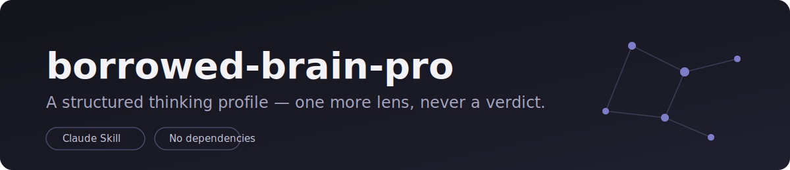
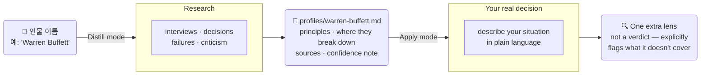

[English](README.md) | [简体中文](README.zh-CN.md) | [한국어](README.ko.md)

[](LICENSE)
[](https://github.com/DOTfei/borrowed-brain-pro/stargazers)
[](SKILL.md)

**공개 인물의 사고방식을 재사용 가능한 프레임워크로 추출한 뒤, 실제로 당신이 마주한 의사결정에 하나의 추가 관점으로 적용하는 AI instruction file입니다.**

Claude(네이티브 Skill), ChatGPT, Open WebUI, Hermes 같은 로컬 모델, 또는 system prompt를 받을 수 있는 어떤 AI에서도 작동합니다. `SKILL.md`를 system prompt로 붙여넣고 시작하면 됩니다.

챗봇 흉내가 아니고, 명언 생성기도 아닙니다. 인터뷰, 의사결정, 실패, 비판처럼 실제 공개 자료를 바탕으로 만든 구조화된 "사고 프로필"입니다. 이 프로필을 당신의 문제에 비춰 보며 *이 프레임워크라면 내가 놓친 무엇을 드러낼까?*를 묻는 도구입니다.

---

## 🚀 방금 설치했다면 여기서 시작하세요

설치한 뒤([설치](#설치) 참고), 새 대화를 열고 아래 문장 중 하나를 그대로 입력하세요. 특별한 문법도, slash command도 필요 없습니다.

```
Naval Ravikant의 사고 프로필을 만들어줘
```
```
Reed Hastings 프로필을 사용해서, 이 채용 결정에서 내가 놓친 게 무엇인지 봐줘 — [상황 설명]
```
```
borrowed-brain-pro는 무엇을 하나요?
```

마지막 질문도 괜찮습니다. 무엇을 물어봐야 할지 모르겠다면 skill 자체에 물어보세요. 두 가지 모드를 설명하고 바로 쓸 수 있는 첫 명령을 제안해 줍니다.

---

## 왜 만들었나

대부분의 "X처럼 생각하기" 프롬프트는 동기부여 포스터 같은 일반론을 뽑아냅니다. 모든 프로필이 비슷하게 들리는 이유는 인물의 잘 다듬어진 공개 이미지에만 기대기 때문입니다.

`borrowed-brain-pro`는 일부러 더 복잡한 자료도 찾습니다. 기록된 실패, 비판, 본인의 설명과 외부 설명이 어긋나는 순간들이 포함됩니다. 실제 의사결정 논리는 그런 지점에서 더 잘 드러나기 때문입니다. 또한 프로필의 모든 "원칙"이 구체적이고 출처가 있는 사실로 거슬러 올라가도록 강제해, 프로필이 미화가 아니라 근거 있는 분석으로 남게 합니다.

## 무엇을 하나요

**Distill 모드** — 인물 이름을 주면 그 사람을 조사해 `profiles/<name>.md`를 만듭니다. 핵심 입장, 반복되는 원칙(각 원칙이 깨질 수 있는 조건 포함), 기본 추론 순서, tradeoff, 기록된 실패, 자료가 얼마나 탄탄한지에 대한 confidence note를 포함합니다.

**Apply 모드** — 기존 프로필을 실제 질문에 적용합니다. 그 렌즈로 상황을 추론하되, 하나의 제한 있는 관점일 뿐 verdict가 아니라는 점을 명확히 표시합니다.



## 예시

아래는 실제로 Distill 모드를 실행해 생성한 [`profiles/reed-hastings.md`](profiles/reed-hastings.md)의 일부입니다. mockup이 아닙니다.

> **Principle**: Actively solicit disagreement rather than assuming silence means agreement ("farming for dissent").
> **Where it shows up**: Built directly out of the Qwikster failure (2011) — Hastings learned that multiple VPs privately doubted the split but didn't say so, with one VP telling him he was "so intense" when convinced of something that it felt unsafe to push back. He now treats withholding disagreement as a failure on the employee's part, not just a personality trait to route around.
> **Where it likely breaks down**: The principle was reactive, not proactive — it was instituted *after* a public 800,000-subscriber, 77%-stock-collapse failure, not before. That suggests the mechanism may not reliably catch conviction-driven blind spots in real time, only in hindsight once the cost has already been paid.

그리고 같은 프로필과 두 번째 프로필([`profiles/travis-kalanick.md`](profiles/travis-kalanick.md))을 함께 불러와 실제 질문에 Apply 모드를 실행하면 서로 다른 관점이 드러납니다.

```
You: We're a fast-growing startup and facing pressure to expand into a city
with hostile regulations our lawyers say is legally risky. Push in or wait?

Claude: Loading both lenses together surfaces real disagreement rather than
a blended answer:

- Kalanick's framework points toward pushing in: his stated market logic
  explicitly weighted regulatory hostility as a *positive* signal — the
  harder the fight, the bigger the moat if you survive it.
- Hastings's framework points the other way: his principle is to build
  context and let good judgment (including the lawyers') carry weight
  rather than override it with personal conviction — and his own
  documented failure (Qwikster) is precisely a case where his certainty
  overrode people trying to raise a concern.

These conflict because they weight the same signal — "resistance from an
authority" — in opposite directions. This tension is useful information,
not something to resolve for you.
```

[`profiles/`](profiles/) 폴더에는 Distill 모드를 실제로 실행해 만든 여덟 개의 프로필이 포함되어 있습니다. 공개 자료가 풍부한 인물, 자료가 얇은 인물, 실제 공개 논란이 있는 인물을 각각 stress test로 골랐고, 바로 사용할 수 있는 도메인별 starter profile도 다섯 개 제공합니다: **Warren Buffett**(투자), **Steve Jobs**(제품), **Chris Voss**(협상), **Richard Feynman**(연구/추론), **Cal Newport**(생산성). 직접 실행하기 전에 아무 파일이나 열어 실제 출력이 어떻게 생겼는지 확인할 수 있습니다.

## 설치

`SKILL.md`는 순수 텍스트 instruction file입니다. 코드도, 의존성도 없습니다. system prompt를 받을 수 있는 어떤 AI에서도 사용할 수 있습니다.

**Claude Code (CLI) — 네이티브 Skill:**
```
mkdir -p ~/.claude/skills/borrowed-brain-pro
cp SKILL.md ~/.claude/skills/borrowed-brain-pro/
```
특정 프로젝트에서만 쓰고 싶다면 `~/.claude/skills/` 대신 해당 프로젝트 안의 `.claude/skills/borrowed-brain-pro/`를 사용하세요.

**Claude.ai:** Settings → Capabilities → Skills를 열고 `SKILL.md`를 직접 업로드하세요.

**ChatGPT / system prompt를 지원하는 모든 AI** — 새 대화를 열고 `SKILL.md` 전체 내용을 system prompt로 붙여넣은 뒤 시작하세요.

**Open WebUI, LM Studio, Ollama(Hermes, Llama, Mistral 등 로컬 모델):** 모델 설정이나 대화의 system prompt 필드에 `SKILL.md`를 붙여넣으세요. 조사 품질은 모델이 웹 검색에 접근할 수 있는지에 따라 달라집니다. 웹 검색이 없다면 모델 자체 지식에 의존하므로, live search가 있는 모델보다 최신성이나 완성도가 낮을 수 있습니다.

어떤 방식이든 세션을 다시 시작하고 인물 이름을 언급하면 됩니다. 예: "`<name>`의 사고 프로필을 만들어줘." API key도, 추가 설정도 필요 없습니다.

skill은 대화에서 사용하는 언어를 따라 출력합니다. 한국어로 대화하면 생성되는 프로필과 Apply 모드의 응답도 한국어가 됩니다.

## Guardrails (내장되어 있으며 선택 사항이 아닙니다)

- 조작된 인용을 만들지 않습니다. 직접 인용은 15단어 이내, 출처당 하나로 제한하고 나머지는 paraphrase합니다.
- 프로필의 모든 claim은 실제로 찾은 출처로 추적 가능해야 합니다.
- 프로필은 "공개 자료에 따르면, 이 사람의 접근 방식은 ...처럼 보인다"는 식으로 framing합니다. 그 사람의 검증된 사적 견해처럼 단정하지 않습니다.
- 사적인 개인에 대한 프로필은 거절합니다. 실질적인 공개 기록이 있는 인물만 다룹니다.
- 논쟁적이거나 정치적인 인물은 기록된 reasoning style만 설명하고, 공개되지 않은 사적 동기를 추측하지 않습니다.

## 이 도구가 아닌 것

- 가짜 인용을 만들거나 누군가의 입에 말을 넣는 도구가 아닙니다.
- 그 사람의 실제 저작을 대체하지 않습니다. 진짜 관점을 알고 싶다면 원문을 읽어야 합니다. 이 도구는 당신이 놓쳤을 수 있는 *각도*를 찾기 위한 것입니다.
- verdict-generator가 아닙니다. 모든 적용이 "이 렌즈가 다루지 못하는 것"으로 끝나도록 설계되어 있습니다.

---

더 나은 source checklist와 example profile 기여를 환영합니다. [CONTRIBUTING.md](CONTRIBUTING.md)를 참고하세요.
